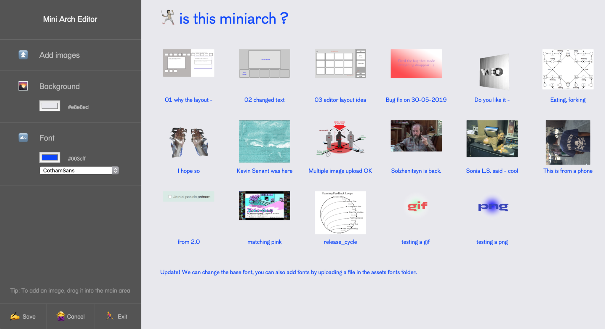

Minimal-Archive
===============

A minimal php/javascript tool to display images on a web page.



**Features**

- Lightweight
- Mobile friendly
- Customize title, note, image captions, fonts, colors.
- Easy installation (basically uploading the folder or starting a local php server).
- Hackable and extendable.
- No database, only files.

## Table of Contents

1. Prerequisites
2. Installation
3. Usage
4. Project structure
5. Translation
6. Development
7. Extras (fonts etc.)

## Prerequisites

```
Production:
php >= 7.0

Developpement:
node
sass
php server
```

## Installation
1. Either clone the repository or download the zipped release from the [release page](https://github.com/tasinttttttt/Minimal-Archive/releases/).
2. Upload the contents of the folder (or the `./www` folder if you chose to clone the project) to your web space. Make sure the folder is writable.
3. Head to `{your-url}/install`.
4. Enjoy `{your-url}` on any device (+ keyboard navigation).

## Usage
1. Head to `{your-url}/edit` with your email and password.
2. Edit everything.
3. Uninstall using `{your-url}/uninstall`.

## Project structure

```sh
Minimal-Archive/
│
├── src/
│   # sources for development
│
└── www/
   # This folder is all you need to deploy to your server
   │
   ├── assets/
   ├── images/
   ├── minimalarchive/
   │
   ├── meta.txt
   │   # This file contains all the page info :)
   │
   └── index.php
```

## Translation

The translation files are located in `www/minimalarchive/translations`.

To update translations, just edit the corresponding file.

To add a translation, add a `json` file to the folder. With the requirement that the name of the file is a two letter language code, for example, spanish would be `es.json`

```
Minimal-Archive/
│
├── ...
└── minimalarchive/
	│
	├── ...
	└── translations/
		├── en.json
		├── fr.json
		└── [two-letters-language-code].json
```

## Development

If you plan to edit the javascript, you may have to compile it. A simple way to do this would be to use `rollup` via `npx` (if you have `npm` installed, just update to a recent version and you should have nothing to worry about).

```sh
# js files
# the -w option is for watching changes
npx rollup ./src/js/index.js --file www/assets/js/index.js --format iife -w
npx rollup ./src/js/edit.js --file www/assets/js/edit.js --format iife -w

# sass files
# this compiles everything you need
sass --watch src/css:www/assets/css
```

## Extra

Suggested Font: [Arcadia Textbook](https://github.com/SamuelRiversMoore/Arcadia-Textbook)
